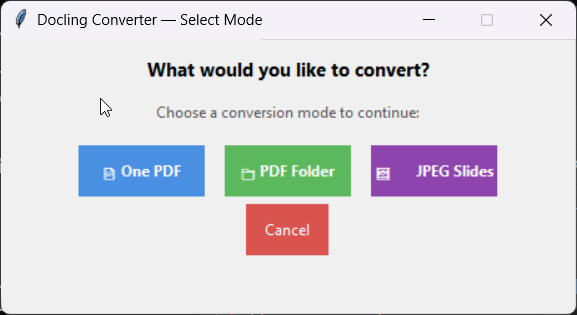
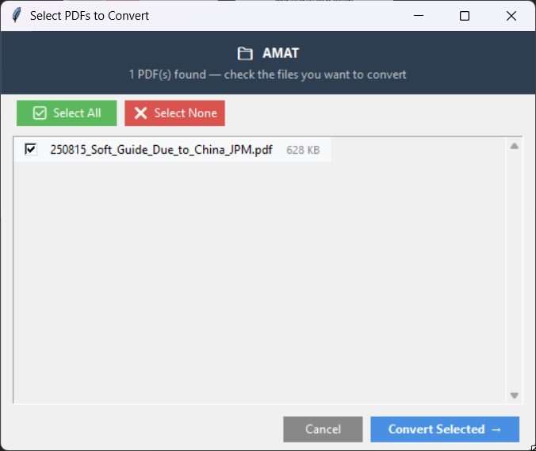
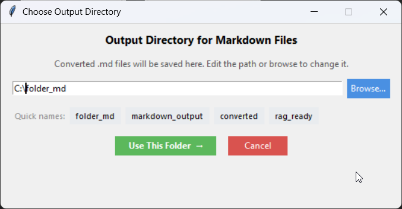

# 📄 Docling PDF & JPEG Slide Converter (Windows 11)

An optimized pipeline designed specifically for **Windows 11** to convert PDFs and image-based slide decks into a markdown document you can put into Obsidian or even create a bunch of RAG-ready Markdown (.md) files. This tool is built to feed high-quality document data into frameworks like **AnythingLLM** or any other pipeline while maintaining a small storage footprint through automated **WebP recompression**.

If you had a PDF, JPEG or a folder of PDFs that you really wanted to put into your notebook as simple markdown, which an embedded graphics where necessary, this is what I'm using for my front end.  I hope it can possibly serve as a stepping off point for others.

V 0.0.1

## ⚙️How it looks

Once you have it up and running, you will get a dialog box as follows:




The options are going to be described below, but you can pick one PDF and quickly convert into an output folder, pick a whole folder of PDFs and put markdown versions into a subfolder, or just take a bunch of JPG of JPEGs and turn them into markdown. 

Once you pick your choice, then you will need to select, through a file GUI, the folder that has the docs in it.  You will be presented with all the docs in this folder.  In the sample below, there is only one PDF, but you can select which files to process.



Finally, you get to select where to put the folder.  Note that you can select from a variety of subfolder names, or simply make your own.  




## 🛠️ Installation & Setup

Follow these steps to get the Docling converter running on your local machine.

### 1. Prerequisites
Before starting, ensure you have the following installed:
* **Docker Desktop**: Required to run the Docling conversion engine.
* **Python 3.10+**: Needed to run the GUI and orchestration scripts.
* **Git**: To clone the repository and manage updates.

### 2. Clone the Repository
Open your terminal (PowerShell or Command Prompt) and run:

```powershell
git clone [https://github.com/Sanborn-Young/PDF2DockerDocling.git](https://github.com/Sanborn-Young/PDF2DockerDocling.git)
cd PDF2DockerDocling
```


## ⚙️ How the System Works Together

Docling is a great app, but it is constantly being updated, and changed.  The great news is that they have a Docker for it, and you can pull the latest version.  Generally, docling is made for more production environments, but I wanted a front end to the container that fit my workload and my selection process.

The tool operates as a three-part orchestration to ensure high-fidelity conversion with zero manual setup:

1.  **The PowerShell Engine (`pull-updated.ps1`)**: Automatically pulls the latest `ghcr.io/docling-project/docling-serve-cpu:latest` Docker image. It manages the container lifecycle and scans your system for a free host port between 5001 and 5095. 

2.  **The Docling Brain (Docker)**: Runs the official Docling Serve AI, which uses advanced layout analysis to understand tables, charts, and multi-column text.
    * 
3.  **The Python Command Center (`rundocling-fixed.py`)**: Provides a GUI for file selection and handles "Post-Processing" by recompressing every image into WebP format based on your local settings.

---

## 🛠️ Dependencies & Auto-Installation

To simplify the user experience, this project **does not use a `requirements.txt` file**. Instead, the main script is designed to self-heal by automatically detecting and installing missing dependencies on its first run.

* **Auto-Installed Packages**: The script will automatically fetch `requests`, `python-dotenv`, and `Pillow` (PIL) via pip if they are not found in your environment.
* **Simplified Workflow**: This allows you to simply download the script and run it without manual environment setup.
* **Bug Reports**: If you encounter any "Module Not Found" errors or installation loops, please **issue a bug report on the GitHub repository** so the auto-install logic can be updated.

---

## 🧪 Conversion Modes (Step 1)

Choose your processing mode from the main selection window:

* **One PDF**: The fastest mode. Converts a single file and outputs directly to your default folder without extra dialogs.
* **PDF Folder**: Batch processes multiple PDFs. Includes a checklist to pick specific files and quick-name buttons for output folders.
* **JPEG Slides**: Converts a folder of images (like PowerPoint exports) into one Markdown file. Recommended for **scanned PDFs** as it uses automatic OCR.

---

## 🖼️ Image Handling Strategy (Step 2)

Fine-tune how visual content is handled for AnythingLLM or archiving:

| Mode | PDF (Text-based) Effect | JPEG Slides Effect |
| :--- | :--- | :--- |
| **Strip Images** | Removes all images; produces the smallest .md files. | OCRs text only; photo-only slides appear blank. |
| **Placeholder** | Replaces images with an `` tag to maintain structure. | OCRs text and inserts `` tags. |
| **Embed Text Images**| Embeds only charts and diagrams as base64 WebP. | OCRs text and embeds only chart/diagram slides. |
| **Embed All Images** | Full archival mode; embeds every page/image as inline WebP. | OCRs text AND embeds every slide as WebP. |

---

## 📂 Configuration & Setup (`.env`)

This project uses a `.env` file to manage local preferences without hardcoding them into the script.

### 1. Activating your Configuration
The repository includes a template file named **`docling_settings.env.example`**. To use it:
* **Rename the file**: Remove the `.example` extension so the file is named exactly **`docling_settings.env`**.
* **Place it**: Ensure it remains in the same root folder as the Python script.

### 2. Customizable Settings
Edit `docling_settings.env` to control the following:
* **`SINGLE_PDF_OUTPUT_DIR`**: Set your default path for one-click conversions.
* **`WEBP_QUALITY`**: Set between 0-100 (Default: 65).
* **`WEBP_METHOD`**: Set between 0-6 (Higher = better compression).
* **`WEBP_MAX_WIDTH/HEIGHT`**: Resize images automatically (Default: 1920x1080).

---

## 📂 Required Project Files & Help

* **`rundocling-fixed.py`**: The main GUI application and conversion logic.
* **`pull-updated.ps1`**: PowerShell script that starts and updates Docker.
* **`HELP_Win11Cute.bat`** & **`HELP.bat`**: Double-click these batch files at any time to see a full help guide, tips, and configuration walkthroughs.
* **`docling_settings.env.example`**: The configuration template.

---

## 💡 Quick Tips
* **For AnythingLLM RAG**: Use **Strip Images** mode for the cleanest possible text ingestion.
* **Docker Status**: Ensure Docker Desktop is running before launching the tool.
* **Output Naming**: In "JPEG Slides" mode, the resulting file is named after the source folder.
